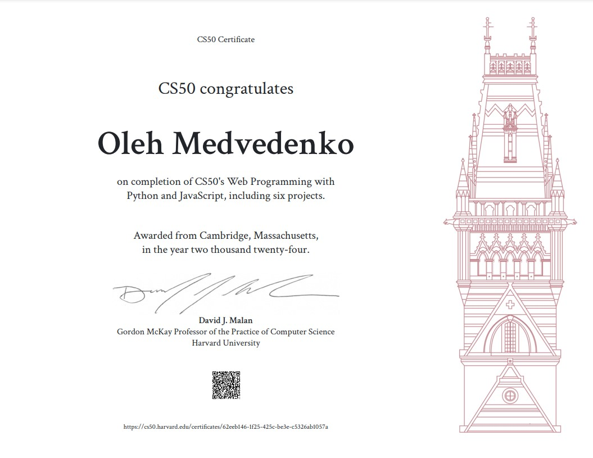
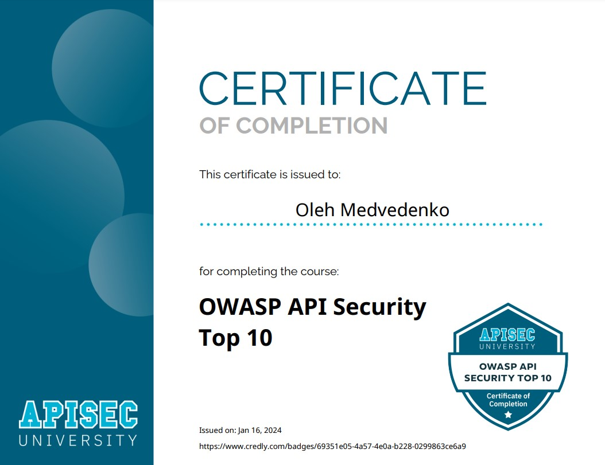
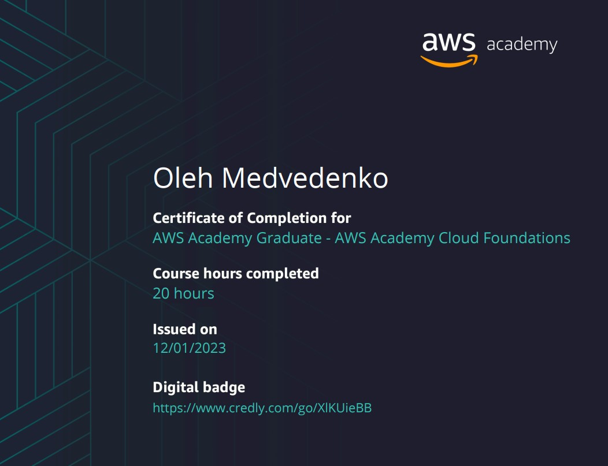

---
- ⚙️ Everlearning Software Engineer with experience in Web Development, Machine Learning, and Cybersecurity.
- 🎓 Master of Software Engineering and Germanic Philology.
- ☕ Mentor and English Teacher.

 

  
📜 Certificates

  | [CS50 Web Programming](https://certificates.cs50.io/62eeb146-1f25-425c-be3e-c5326ab1057a.pdf?size=letter) | [Google Cybersecurity](https://www.coursera.org/account/accomplishments/specialization/certificate/78LBGT97YPSH) | [Palo Alto Cybersecurity](https://www.coursera.org/account/accomplishments/specialization/CYNIFHCTQQNG) | [APISEC OWASP TOP 10](https://www.credly.com/badges/69351e05-4a57-4e0a-b228-0299863ce6a9/linked_in_profile) |
  |-----------------------|-----------------------|-----------------------|-----------------------|
  |  |  |  |  |
  | [Docker Foundations](https://www.linkedin.com/learning/certificates/0397b5920a218aa886dd2608044987bd677987bcd92ad07eaa3a246fd21da9e2?lipi=urn%3Ali%3Apage%3Ad_flagship3_profile_view_base_certifications_details%3BXOspd7UySp%2B6eia5c%2FlyQg%3D%3D) | [AWS Academy Cloud Foundations](https://www.credly.com/badges/649ab330-db84-44da-824b-3368c74fc0d4/linked_in_profile) | [Hillel Python Pro](https://certificate.ithillel.ua/view/75674752) | [Hillel Machine Learning](https://certificate.ithillel.ua/view/56207337) |
  |  |  |  |  |
  | Anhalt Distributed Systems | [Neural Networks and Deep Learning](https://www.coursera.org/account/accomplishments/verify/2V1RQOP35XR7) |        |        |
  |  |  |  |  |

<!--
**chtholine/chtholine** is a ✨ _special_ ✨ repository because its `README.md` (this file) appears on your GitHub profile.

Here are some ideas to get you started:

- 🔭 I’m currently working on ...
- 🌱 I’m currently learning ...
- 👯 I’m looking to collaborate on ...
- 🤔 I’m looking for help with ...
- 💬 Ask me about ...
- 📫 How to reach me: ...
- 😄 Pronouns: ...
- ⚡ Fun fact: ...
-->
